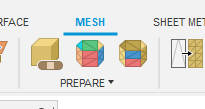
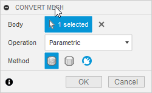
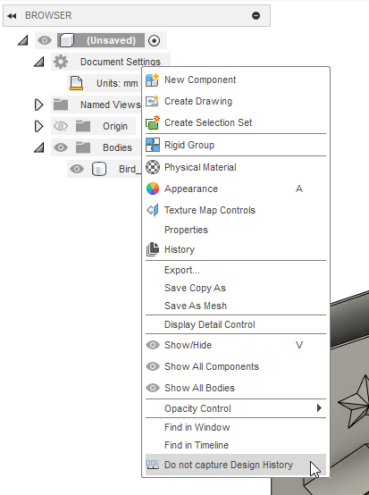

# Trucs et astuces pour Fusion 360

# Importer un modèle STL et le modifier

## Importation
- Passer le bouton "Insert"
- Cliquer sur "Insert Mesh"
- Sélectionner le fichier STL
- Sélectionner l'unité de mesure
- Cliquer sur Ok

## Convertir en corps (body)
- Sélectionner le mesh
- Aller dans l'onglet "Mesh"
- Sélectionner le bouton "Generate Face Groups"
  - Bouton du centre
  - 
- Sélectionner l'entiereté du mesh
- Cliquer sur "Ok"
- Appuyer sur "s" pour ouvrir le menu de recherche
- Chercher et sélectionner "Convert Mesh"
  - Cette commande permet de convertir le mesh en corps (body)
  - 
- Si c'est la version éducative (Pro), vous pouvez sélectionner la méthode "Prismatic". Cela convertira l'objet en corps
- Cliquer sur "Ok"

## Fusionner les surfaces
- Désactiver la capture de l'historique
  - Clic droit sur `document settings`
  - 
- Sous l'onglet "Surface", sous le menu "Modify", sélectionner "Merge"
- Sélectionner les faces d'un coté
- Cliquer sur "Ok"