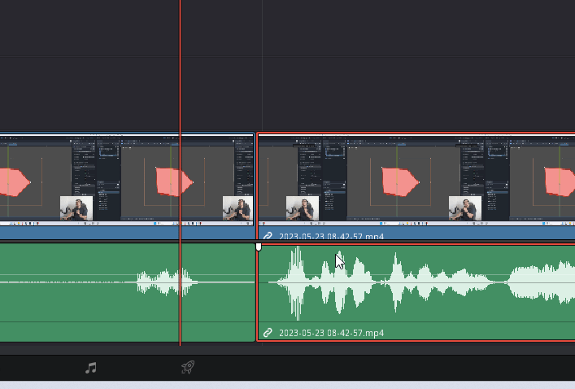

# Workflow général et astuces pour DaVinci Resolve <!-- omit in toc -->

# Table des matières <!-- omit in toc -->
- [Workflow](#workflow)
  - [Importer les clips](#importer-les-clips)
  - [Banderole Cégep Shawi](#banderole-cégep-shawi)
  - [Utiliser la lame (Blade) \[B\]](#utiliser-la-lame-blade-b)
  - [Ajouter l'image finale](#ajouter-limage-finale)
- [Astuces rapides](#astuces-rapides)
  - [Ajouter un gif](#ajouter-un-gif)
  - [Faire un fade in/out](#faire-un-fade-inout)
  - [Faire une transition](#faire-une-transition)
  - [Ajouter un texte](#ajouter-un-texte)
  - [Sélectionner les clips à droite du marqueur](#sélectionner-les-clips-à-droite-du-marqueur)
  - [Changer la vitesse d'une séquence](#changer-la-vitesse-dune-séquence)
- [Références](#références)

# Workflow

## Importer les clips
1. Ouvrir l'appli
2. Glisser les clips dans le media pool
3. Glisser les clips dans le TimeLine de Video 1

## Banderole Cégep Shawi
1. Activer le volet "Effects" (Haut gauche)
2. Dans "Toolbox", glisser un "Fusion composition" dans un nouveau timeline vidéo 2
3. Sélectionner le "Fusion composition" dans le TimeLine
4. Aller dans le mode Fusion (Boutons du bas)
5. Dans la section "Templates->My templates", glisser la "banderole"
7. Revenir à "Edit"

## Utiliser la lame (Blade) [B]
1. Utile pour enlever les silences, les "euuhh", etc.
2. [A] pour le mode sélection

## Ajouter l'image finale
1. Glisser l'image "panneau cegep shawinigan.jpg" sur la 2e ligne de temps

# Astuces rapides

## Ajouter un gif
1. Convertir avec handbrake en mp4 en utilisant H264 ou h265
2. Ajouter dans la ligne de temps 2 ou plus à l'endroit désiré
3. Modifier le zoom et la position

## Faire un fade in/out
1. Sélectionner le clip
2. Mettre le pointeur de la souris sur le coin supérieur gauche ou droit du clip
3. Cliquer et glisser vers le centre du clip
4. On devrait voir une ligne de transparence
5. Relâcher la souris

## Faire une transition
1. Sélectionner le 2e clip
2. Le faire "overlap" en le glissant sur le 1er clip
3. Dans les "effects", sélectionner "Video transitions"
4. Sélectionner la transition désirée
5. Glisser la transition entre les 2 clips (Zone de "overlap")

## Ajouter un texte
Pour ajouter un texte rapide pour, par exemple, un correctif, on peut utiliser le "Text" de Fusion.
1. Dans "Effets->Toolbox->Titles", sélectionner "Text"
2. Glisser le "Text" dans la timeline "Video 2"
3. Modifier le texte dans le "Inspector" (Haut droit)

## Sélectionner les clips à droite du marqueur
- ALT + Y 

## Changer la vitesse d'une séquence
1. Sélectionner la séquence
2. Cliquer droit sur la séquence
3. Sélectionner "Retime controls"
4. Modifier le pourcentage de vitesse désiré

# Références
- https://www.mnn.org/blog/create-reusable-lower-third-template-davinci-resolve
- [Keyboard shortcuts](https://motionarray.com/learn/davinci-resolve/davinci-resolve-keyboard-shortcuts/)