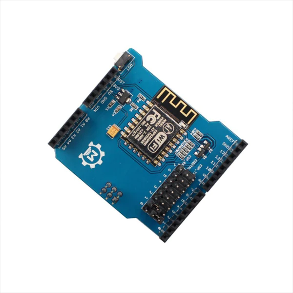
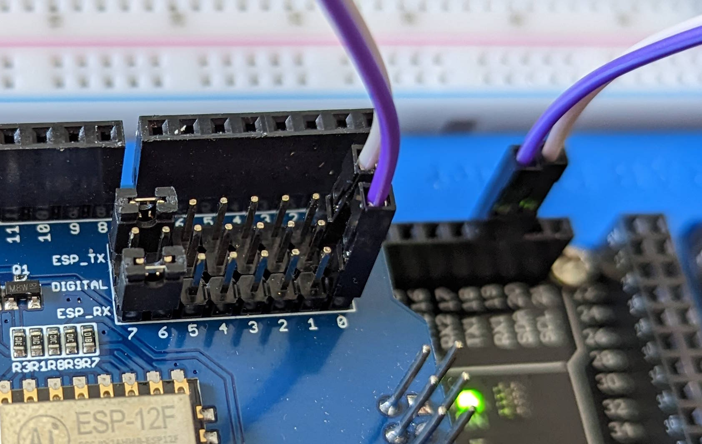
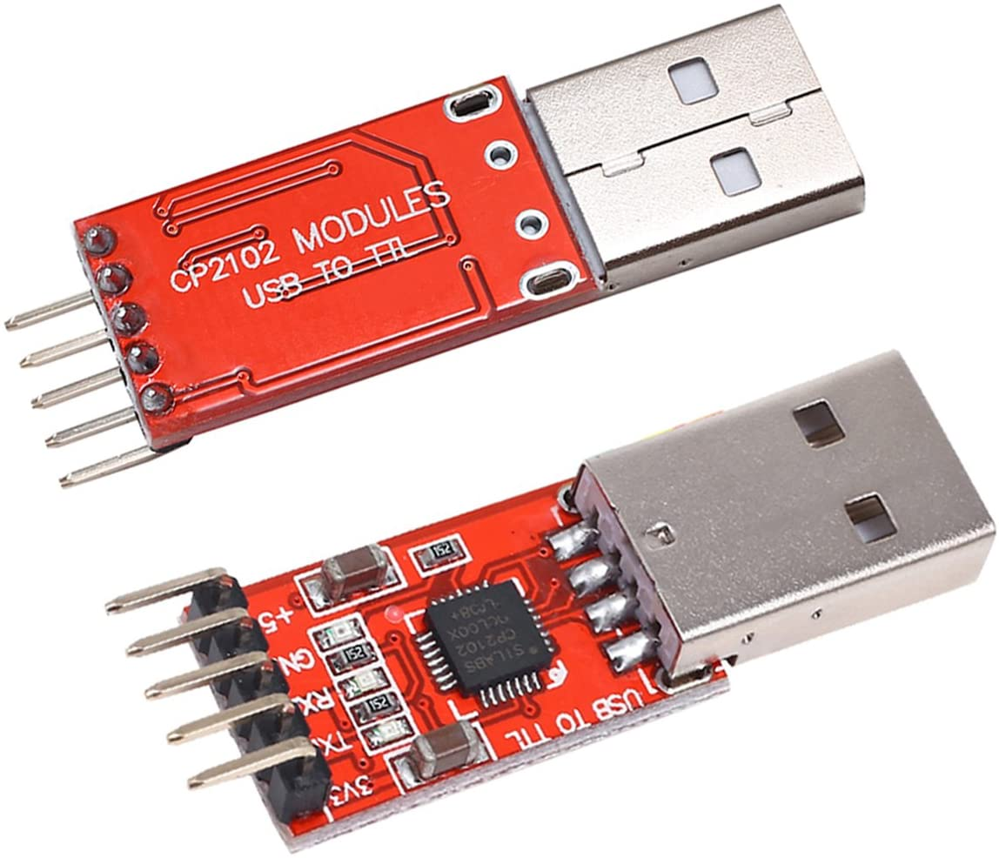
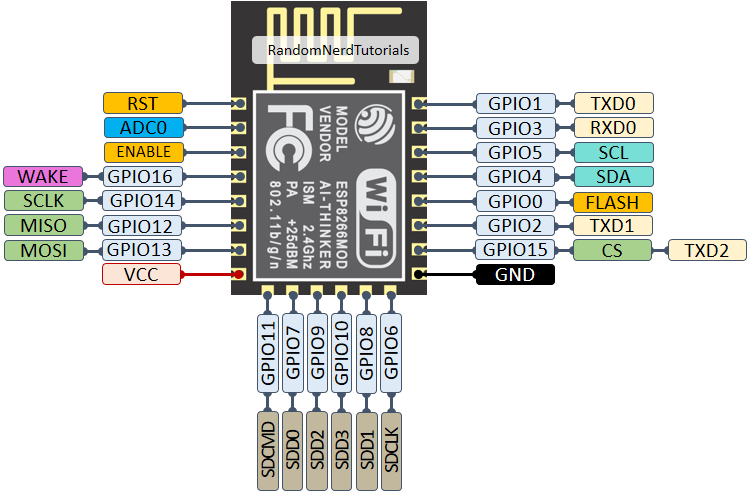
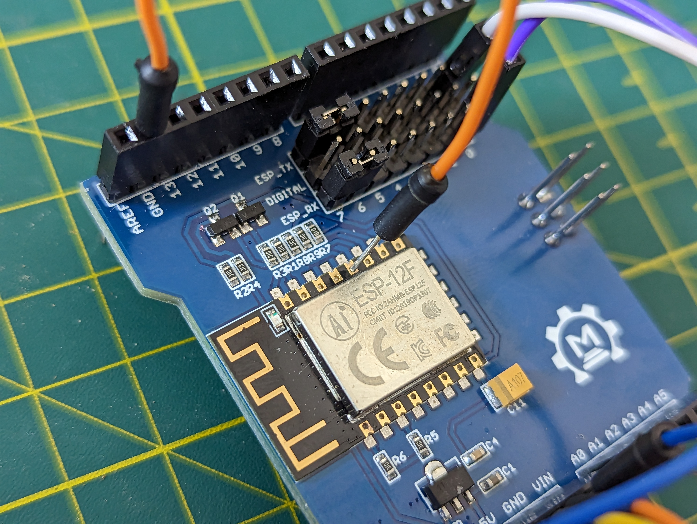
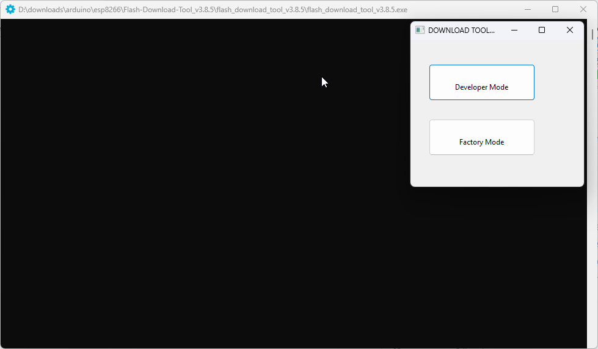
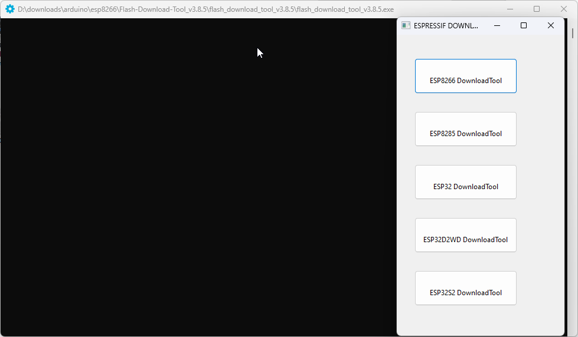
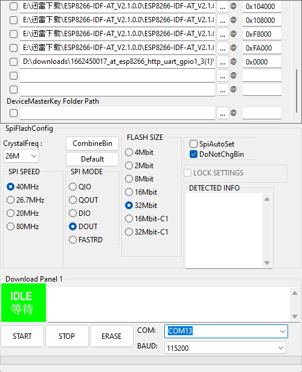
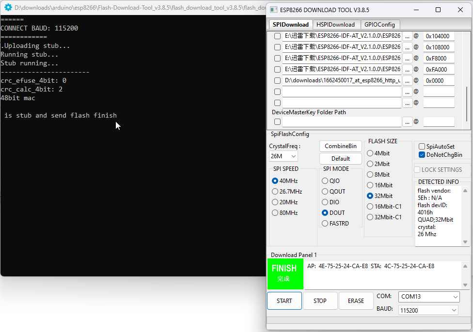
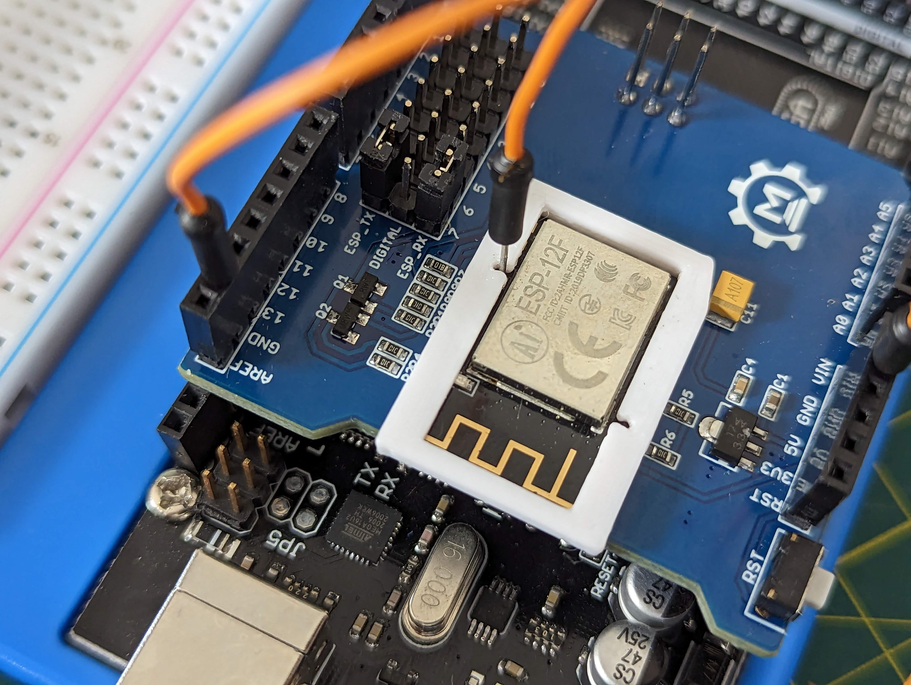

# Makerfabs ESP8266 WiFi Shield
Ce document est une amélioration et un complément du document [ESP8266 WiFi Shield](https://ca.robotshop.com/products/esp8266-wifi-shield) (RB-Mkf-14) de RobotShop.



## Table des matières
- [Makerfabs ESP8266 WiFi Shield](#makerfabs-esp8266-wifi-shield)
  - [Table des matières](#table-des-matières)
- [Firmware compatible pour le cours](#firmware-compatible-pour-le-cours)
- [Configuration avec Arduino IDE](#configuration-avec-arduino-ide)
- [Arduino Mega](#arduino-mega)
  - [Branchement au RX1/TX1](#branchement-au-rx1tx1)
  - [Code d'exemple](#code-dexemple)
- [Mise à jour du firmware](#mise-à-jour-du-firmware)
- [Connexion au module ESP8266](#connexion-au-module-esp8266)
- [Mise à jour du firmware avec ESP8266 Download Tool v3.8.5](#mise-à-jour-du-firmware-avec-esp8266-download-tool-v385)
- [Mise à jour du firmware avec esptool.py](#mise-à-jour-du-firmware-avec-esptoolpy)
  - [Installation de l'outil esptool.py](#installation-de-loutil-esptoolpy)
  - [Sauvegarde du firmware](#sauvegarde-du-firmware)
  - [Effacement du firmware](#effacement-du-firmware)
  - [Téléversement du firmware](#téléversement-du-firmware)
- [Tester le module avec Arduino](#tester-le-module-avec-arduino)
- [Extra](#extra)
  - [](#)
- [Références](#références)

# Firmware compatible pour le cours
- [Fichier avec des firmwares compatibles](assets/from_instructables.zip)


# Configuration avec Arduino IDE
1. Assurez-vous qu'il n'y a pas de code en cours d'exécution sur l'Arduino.
   - Vous pouvez téléverser un code vide ou l'exemple `Blink`.
2. Empilez le shield sur le dessus de l'Arduino.
3. Vérifiez que le cavalier sur le shield correspond à la broche RX/TX de l'Arduino (TX-TX et RX-RX).
   - Il faut que le cavalier ESP_TX soit relié à la broche TX de l'Arduino et ESP_RX soit relié à la broche RX de l'Arduino. **Ce n'est pas une erreur**, il le faut pour que la communication via le USB se fasse directement au shield. L'Arduino ne sert que de support pour l'électricité à ce point.
   - Généralement, il s'agit des broches 0 et 1 de l'Arduino.
4. Ouvrez l'IDE Arduino.
5. Obtenez la bibliothèque `WiFiEsp` en allant dans le gestionnaire de bibliothèques.
   - Chercher `WiFiEsp` (il ne devrait y avoir qu'un seul choix)
6. Connectez l'Arduino.
7. Sélectionnez la carte Arduino et le bon port COM.
8. Ouvrez le Moniteur Série, sélectionnez `Both NL & CR` et réglez le débit en bauds à 115200.<
9. Tapez la commande `AT` dans la moniteur série. Vous devriez recevoir `OK` en retour.
   - Si vous ne recevez rien, il se peut que n'ayez pas changé les cavaliers sur le shield ou que vous n'avez pas mis `Both NL & CR` dans le moniteur série ou encore le module a été configuré à une autre vitesse de communication.
10. Changez le débit en bauds du module `ESP8266` à 9600 en tapant cette commande :<br/>
    `AT+CIOBAUD=9600` (cela ne doit être fait qu'une fois).
    - Cette action change la vitesse de communication du module `ESP8266` en utilisant une commande `AT`. Il faudra en prendre considération lors de configuration future du module.
11. Déconnectez tout.
12. Testez la configuration en envoyant la commande `AT` via le moniteur série.
    - Assurez-vous d'avoir configuré le moniteur série à la nouvelle vitesse.
13. Déconnectez tout.

> ***Important*** : Cette partie semble fonctionner que pour l'Arduino Uno. Pour l'Arduino Mega, il faut désactiver les cavaliers et brancher sur les RX1/TX1. En effet, `SoftwareSerial` ne fonctionne pas pour les broches qui sont sur le shield avec le Mega ([Source](https://docs.arduino.cc/learn/built-in-libraries/software-serial)).

14. Changez le cavalier de sorte que le RX du shield soit relié à la broche n°3 de l'Arduino.
    - ESP_RX doit être relié à la broche 3 de l'Arduino.
    - Nous allons utiliser `SoftwareSerial` pour communiquer avec le module `ESP8266`
15. Changez le cavalier de sorte que le TX du shield soit relié à la broche n°2 de l'Arduino.
    - ESP_TX doit être relié à la broche 2 de l'Arduino. 
    - Nous allons utiliser `SoftwareSerial` pour communiquer avec le module `ESP8266`

> **Note :** Pour les étapes 11 et 12, cela dépendra du code envoyer dans l'Arduino.

---

# Arduino Mega

## Branchement au RX1/TX1

- Désactiver les cavaliers en les plaçant en parallèle (voir image ci-dessous).


- Brancher le RX du shield sur la broche TX1 de l'Arduino Mega.
- Brancher le TX du shield sur la broche RX1 de l'Arduino Mega.

## Code d'exemple

```cpp
/*
 WiFiEsp example: WebClient

 This sketch connects to google website using an ESP8266 module to
 perform a simple web search.

 For more details see: http://yaab-arduino.blogspot.com/p/wifiesp-example-client.html
*/

#include "WiFiEsp.h"

char ssid[] = "ssid";            // your network SSID (name)
char pass[] = "ssid_pw";        // your network password
int status = WL_IDLE_STATUS;     // the Wifi radio's status

char server[] = "arduino.cc";

// Initialize the Ethernet client object
WiFiEspClient client;

void setup()
{
  // initialize serial for debugging
  Serial.begin(9600);
  // initialize serial for ESP module
  Serial1.begin(9600);
  // initialize ESP module
  WiFi.init(&Serial1);

  // check for the presence of the shield
  if (WiFi.status() == WL_NO_SHIELD) {
    Serial.println("WiFi shield not present");
    // don't continue
    while (true);
  }

  // attempt to connect to WiFi network
  while ( status != WL_CONNECTED) {
    Serial.print("Attempting to connect to WPA SSID: ");
    Serial.println(ssid);
    // Connect to WPA/WPA2 network
    status = WiFi.begin(ssid, pass);
  }

  // you're connected now, so print out the data
  Serial.println("You're connected to the network");
  
  printWifiStatus();

  Serial.println();
  Serial.println("Starting connection to server...");
  // if you get a connection, report back via serial
  if (client.connect(server, 80)) {
    Serial.println("Connected to server");
    // Make a HTTP request
    client.println("GET /asciilogo.txt HTTP/1.1");
    client.println("Host: arduino.cc");
    client.println("Connection: close");
    client.println();
  }
}

void loop()
{
  // if there are incoming bytes available
  // from the server, read them and print them
  while (client.available()) {
    char c = client.read();
    Serial.write(c);
  }

  // if the server's disconnected, stop the client
  if (!client.connected()) {
    Serial.println();
    Serial.println("Disconnecting from server...");
    client.stop();

    // do nothing forevermore
    while (true);
  }
}


void printWifiStatus()
{
  // print the SSID of the network you're attached to
  Serial.print("SSID: ");
  Serial.println(WiFi.SSID());

  // print your WiFi shield's IP address
  IPAddress ip = WiFi.localIP();
  Serial.print("IP Address: ");
  Serial.println(ip);

  // print the received signal strength
  long rssi = WiFi.RSSI();
  Serial.print("Signal strength (RSSI):");
  Serial.print(rssi);
  Serial.println(" dBm");
}

```

Dans le moniteur série, vous devriez avoir un message comme celui-ci :

```text
[WiFiEsp] Initializing ESP module
[WiFiEsp] Initilization successful - 1.5.4
Attempting to connect to WPA SSID: YOUR_NETWORK_NAME
[WiFiEsp] Connected to YOUR_NETWORK_NAME
You're connected to the network
SSID: YOUR_NETWORK_NAME
IP Address: 10.79.83.219
Signal strength (RSSI):-52 dBm

Starting connection to server...
[WiFiEsp] Connecting to arduino.cc
Connected to server

Disconnecting from server...
```

---

# Mise à jour du firmware

Attention! Cette partie est très dangereuse. Si vous ne savez pas ce que vous faites, vous risquez de brûler votre module `ESP8266`. Il est donc fortement recommandé de sauvegarder le firmware actuel avant de le modifier.

# Connexion au module ESP8266
Si vous avez un module qui n'a pas de port USB, vous devez utiliser un adaptateur USB-UART. Vous pouvez en trouver sur [Amazon](https://a.co/d/1gRKGrE).



Pour le branchement, il faut relier les broches suivantes :

| USB-UART | ESP8266 |
|----------|---------|
| GND      | GND     |
| RX       | TX      |
| TX       | RX      |
| 3.3V     | 3.3V*    |

> **\*** Si vous utilisez un module avec un régulateur de tension par exemple un shield Arduino, vous pouvez utiliser le 5V de l'adaptateur et le brancher dans l'entrée du voltage.

Il faudra aussi brancher le port **GPIO0 sur GND** pour que le module entre en mode flash. Pour cela, vous pouvez utiliser un jumper ou un bouton relié à la masse.





# Mise à jour du firmware avec ESP8266 Download Tool v3.8.5
[Source de l'article original](https://www.makerfabs.cc/article/esp8266-wifi-shield-firmware-upgrade-v1-0.html)

Vous pouvez aussi utiliser l'outil **ESP8266 Download Tool**. Dans le cas présent, nous avons utilisé la version 3.8.5  pour téléverser le firmware.

> **Note :** Avant d'effectuer la mise à jour, il est fortement recommandé de sauvegarder le firmware actuel. Pour cela, vous pouvez vous référer à la partie [Mise à jour du firmware avec esptool.py](#mise-à-jour-du-firmware-avec-esptoolpy)

Il suffit de lancer l'application et de suivre les étapes suivantes :



1. Cliquer sur `Developer Mode`
2. Cliquer sur `ESP8266 DownloadTool`
   
3. Sélectionner le port COM de votre module
4. S'assurer que GPIO0 est sur GND
5. Toucher rapidement la broche `RST` avec le ground pour mettre le module en mode flash


   On ne voit pas dans la vidéo, mais la DEL bleu du module s'allume très brièvement.
6. S'assurer que rien n'est coché dans la liste des fichiers


   
7. Cliquer sur `Start`
   Après avoir sur `Start`, l'application cherchera et affichera les informations du module
   

   
8. Récupérer le firmware téléchargé dans la source de l'article original
9. Ajouter le firmware à fin de la liste des fichiers
10. Mettre l'adresse de début à `0x00000`
11. Cocher la case devant le fichier
12. Sélectionner les mêmes options que dans les captures d'écran
13. Appuyer sur `Start`
    1.  Le téléversement du firmware peut prendre plusieurs minutes. Une fois terminé, vous devriez avoir un message comme celui-ci :
        `is stub and send flash finish`

Pour tester le module, vous n'avez qu'à suivre les étapes de la section [Configuration avec Arduino IDE](#configuration-avec-arduino-ide).

# Mise à jour du firmware avec esptool.py

## Installation de l'outil esptool.py
Avant de modifier le firmware, il faut le sauvegarder. Pour ce faire, nous avons beesoin de l'outil `esptool.py` qui est disponible [ici](https://github.com/espressif/esptool). Il suffit de télécharger ou cloner le dépôt et de lancer la commande suivante :

Dans le dossier `esptool`, lancez la commande suivante pour effectuer l'installation :

```bat
python setup.py install
```

> **Note :** Dépendant de votre installation de python, vous devrez peut-être lancer la commande dans un terminal en mode administrateur.

## Sauvegarde du firmware
La première étape sera de lire la dimension du firmware actuel. Pour cela, il faut lancer la commande suivante :

```bat
python esptool.py --port COM3 flash_id
```

- `COM3` est le port de votre module. Il peut être différent de celui-ci.

Voici un exemple de résultat :

```text
esptool.py v4.6-dev
Serial port COM13
Connecting...
Detecting chip type... Unsupported detection protocol, switching and trying again...
Connecting...
Detecting chip type... ESP8266
Chip is ESP8266EX
Features: WiFi
Crystal is 26MHz
MAC: 4c:75:25:26:7a:04
Stub is already running. No upload is necessary.
Manufacturer: 5e
Device: 4016
Detected flash size: 4MB
Hard resetting via RTS pin...

```

On peut voir que le firmware fait 4MB. Il faut maintenant le sauvegarder. Pour cela, il faut lancer la commande suivante :

```bat
python esptool.py --port COM3 read_flash 0x00000 0x400000 esp8266_backup.bin
```

Cette action peut prendre plusieurs minutes. Une fois terminée, vous devriez avoir un fichier `esp8266_backup.bin` dans le dossier `esptool`.

Voici un exemple de résultat :

```text	
esptool.py v4.6-dev
Serial port COM13
Connecting...
Detecting chip type... Unsupported detection protocol, switching and trying again...
Connecting...
Detecting chip type... ESP8266
Chip is ESP8266EX
Features: WiFi
Crystal is 26MHz
MAC: 4c:75:25:26:7a:04
Stub is already running. No upload is necessary.
4194304 (100 %)
4194304 (100 %)
Read 4194304 bytes at 0x00000000 in 392.8 seconds (85.4 kbit/s)...
Hard resetting via RTS pin...
```

## Effacement du firmware
Avant d'effectuer la mise à jour du firmware, il faut effacer le contenu de la mémoire flash. Pour cela, il faut lancer la commande suivante :

```bat
python esptool.py --port COM3 erase_flash
```

Cela prendra quelques secondes et on ne verra pas de lumière sur le module. Une fois terminé, vous devriez avoir un message comme celui-ci :

```text
esptool.py v4.6-dev
Serial port COM13
Connecting...
Detecting chip type... Unsupported detection protocol, switching and trying again...
Connecting...
Detecting chip type... ESP8266
Chip is ESP8266EX
Features: WiFi
Crystal is 26MHz
MAC: 4c:75:25:24:ca:e8
Stub is already running. No upload is necessary.
Erasing flash (this may take a while)...
Chip erase completed successfully in 12.9s
Hard resetting via RTS pin...
```

## Téléversement du firmware
Après avoir faites toutes les étapes précédentes, on peut passer au téléversement du firmware. Pour cela, il faut lancer la commande suivante :

Pour un module de 4MB :
```bat
python esptool.py --port COM3 write_flash -fs 4MB -fm dout 0x0 nouveauFirmware.bin
```

Pour un module de 2MB :
```bat
python esptool.py --port COM3 write_flash -fs 2MB -fm dout 0x0 nouveauFirmware.bin
```

- `COM3` est le port de votre module. Il peut être différent de celui-ci.
- La taille du firmware dépend de la taille de votre module. Si vous avez un module de 1MB, il faut utiliser la commande pour un module de 1MB.
- *nouveauFirmware.bin* est le chemin vers le fichier du firmware.

---

# Tester le module avec Arduino

TODO : Ajouter les informations pour tester le module avec le terminal

---

# Extra
- Gabarit 3D à imprimer pour protéger les broches et n'exposer que GPIO0 et RST. 
[Fichier STL](assets/esp-12f%20flashing%20frame.stl)


---

# Références
- [Site officiel - OAS8266WF](https://www.makerfabs.com/esp8266-wifi-shield.html)
