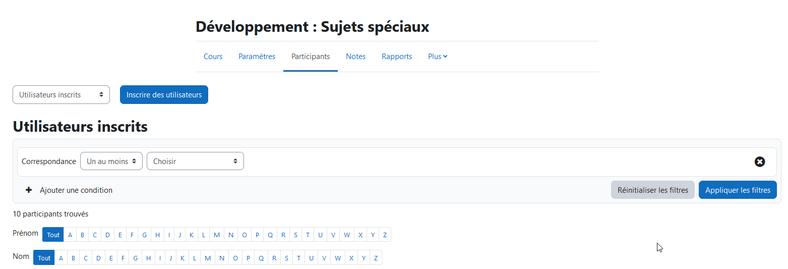

# Workflows pour Moodle <!-- omit in toc -->

- [Évaluation, Quiz et Test](#évaluation-quiz-et-test)
  - [Créer un test en format GIFT avec médias](#créer-un-test-en-format-gift-avec-médias)
    - [Insérer des images dans un test GIFT](#insérer-des-images-dans-un-test-gift)
    - [Pour catégoriser les questions](#pour-catégoriser-les-questions)
  - [Importer les questions GIFT dans Moodle](#importer-les-questions-gift-dans-moodle)
  - [Créer un test sur Moodle](#créer-un-test-sur-moodle)
  - [Dupliquer un test sur Moodle](#dupliquer-un-test-sur-moodle)
  - [Ajouter des questions au test](#ajouter-des-questions-au-test)
  - [Correction des évaluations](#correction-des-évaluations)
    - [Correction manuelle](#correction-manuelle)
- [Gestion des utilisateurs](#gestion-des-utilisateurs)
  - [Sauvegarder les données des étudiants](#sauvegarder-les-données-des-étudiants)
  - [Désinscrire les étudiants en lot](#désinscrire-les-étudiants-en-lot)
- [Intégrer une page web dans Moodle](#intégrer-une-page-web-dans-moodle)


# Évaluation, Quiz et Test

## Créer un test en format GIFT avec médias
1. Écrire les questions dans un fichier « .gift »
2. Modifier l’extension pour « .txt »
   - [Source](https://docs.moodle.org/401/en/Gift_with_medias_format) dans la section « Tips »
3. Compresser le dossier avec le fichier « .gift » ainsi que le dossier des images

### Insérer des images dans un test GIFT
1. Créer un dossier « img »
2. Mettre les images à l’intérieur.
3. Utiliser la balise `<br/>`

Voici un exemple de fichier GIFT avec médias :
```gift
$CATEGORY: Référence

::Référence::  <br/>

$CATEGORY: Terminal/Analyse de code

::Analyse de code::
[markdown]
Considérez le code suivant<br/>
<br/>
Décrivez ce que fait le code. {}

::Analyse de code::
[markdown]
Considérez le code suivant<br/>
<br/>
Décrivez ce que fait le code. {}
```

### Pour catégoriser les questions
- Ajouter la ligne « $CATEGORIE: NomExamen/catégorie/sous-catégorie… » entre chaque catégorie de questions.

## Importer les questions GIFT dans Moodle
1. Atteindre le cours
2. Activer le mode d’édition
3. Aller dans « Plus --> Banque de questions »
4. Cliquer sur « Questions » et sélectionner « Importer »
5. Sélectionner « GIFT »
   1. Ou « Format Gift avec des fichiers média » si applicable
6. Choisir le fichier `.zip` à importer
   1. Fichier `.gift` s’il n’y a pas d’images

## Créer un test sur Moodle
- Créer le test
- Masquer le contenu jusqu’au moment d’ouvrir l’évaluation
- Marquer la date de l’ouverture
  - [Optionnel] : Marquer le temps disponible
- Marquer le nombre de tentatives que les étudiants peuvent faire
  - 1 généralement

## Dupliquer un test sur Moodle
- Dans la page principale du cours
- Aller au Quiz à dupliquer
- Cliquer sur les trois points à droite du Quiz
- Cliquer sur « Copier »

## Ajouter des questions au test
1. Dans le test, atteindre la section « Questions ».
2. Cliquer sur « Ajouter »
3. Sélectionner les options désirées
4. Ajuster les points au besoin

## Correction des évaluations

### Correction manuelle
1. Aller dans le test
2. Cliquer sur l'onglet "Résultats"
3. Sélectionner "Évaluation manuelle"
4. Sélectionner "Tout évaluer" pour chaque question


# Gestion des utilisateurs
## Sauvegarder les données des étudiants
1. Aller dans le cours
2. Aller dans la section « Participants »
3. Sélectionner les étudiants à sauvegarder
4. Dans la liste déroulante dans le bas de la page, sélectionner « Télécharger les données au format » qui vous convient.

## Désinscrire les étudiants en lot
Après un certain temps, il est possible que certains utilisateurs ne soient plus actifs dans le cours. Il est possible de les désinscrire en lot.

> **Important**
> 
> Avant de désinscrire les utilisateurs, il est préférable de faire une sauvegarde des utilisateurs inscrits dans le cours. Voir cette section.

Dans l'installation actuel au Cégep, il semble y avoir un bogue avec l'option de désinscription en lot. Il est possible de désinscrire les utilisateurs en lot en utilisant la méthode suivante:

1. Aller dans le cours
2. Aller dans la section « Participants »
3. Dans la liste déroulante qui est inscrit "Utilisateurs inscrits", sélectionner "Méthode d'inscription"
   

<br />

4. Supprimer la méthode d'inscription.
   - **Attention!** Cette action va désinscrire tous les utilisateurs du cours qui ont été inscrits par cette méthode.

# Intégrer une page web dans Moodle
Il est possible d'héberger un site web au sein de Moodle en suivant les instructions suivantes :

1. Assurez-vous que tous les liens de vos pages web sont relatifs les uns aux autres. Cela signifie que si vous avez une page index.html et une page book.html dans le même répertoire, pour faire un lien vers la page book.html à partir de la page index, vous avez “/book.html”. Les liens ne fonctionneront pas correctement sinon.
2. Compressez le répertoire racine du site en un seul fichier zip.
3. Allez au cours Moodle et sélectionnez le bouton "Mode Édition" en haut à droite pour commencer à éditer le site du cours.
4. Choisissez le Bloc des Sujets où vous souhaitez ajouter le devoir et cliquez sur Ajouter une activité ou une ressource.
5. Sélectionnez l'activité "Fichier" dans le sélecteur d'activités.
6. Ajoutez le fichier zip comme le fichier pour cette ressource.
7. Sélectionnez le fichier zip dans le sélecteur de fichiers, et une fenêtre contextuelle apparaîtra. Choisissez "Décompresser", un dossier apparaîtra dans le sélecteur de fichiers.
8. Naviguez dans le dossier et sélectionnez votre page “index”. Une fois sélectionnée, choisissez l'option "Spécifier comme fichier principal" depuis la fenêtre contextuelle.
9. Sous l'option de ressource "Apparence", il y a plusieurs options d'affichage qui vous permettent de définir la page web pour qu'elle soit intégrée au site, s'ouvre dans une pop-up, etc.

> **Note :** Les fichiers individuels peuvent être mis à jour une fois ce processus terminé, vous n'aurez donc pas besoin de télécharger à nouveau le fichier zip complet chaque fois qu'un changement est nécessaire.

Source : https://help.lafayette.edu/importing-a-website-into-moodle/

