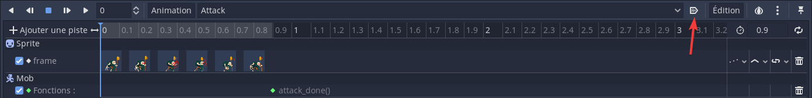

# Troubleshooting
Listes des problèmes auxquels je me suis confrontés durant le développement.

## Trouble de *stuttering animation*
- Vérifier que le noeud AnimationPlayer n'est pas une animation réglée à lecture automatique. On voit cette propriété dans le volet Animation. 

## Animation qui boucle en continue
- Avec le noeud `AnimationTree`, si une animation boucle en continue, une méthode est d'ajouter un déclencheur à la fin de l'animation pour faire changer d'état.
  - Exemple
    - Créer une méthode appelée `attack_done()` dans le script qui s'occupe du noeud animé. Ajouter un `print ("attack_done")` pour s'assurer de l'appel de celle-ci.
    - Ajouter une **piste d'appel de méthode**, sélectionner le noeud possédant le script et la méthode `attack_done()`.
